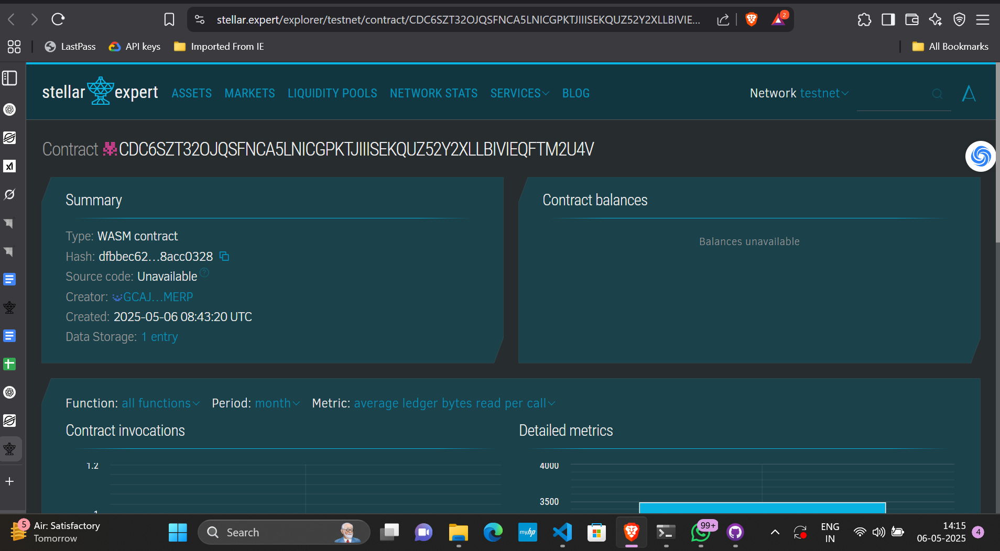

# E-commerce Website for Local Businesses

## Project Description
A decentralized platform enabling local vendors to list and sell their products online using Soroban smart contracts. This system ensures transparency, immutability, and direct access to product data without reliance on centralized entities.

## Project Vision
Empower local businesses with blockchain-backed technology to showcase their products globally, reduce operational friction, and gain trust through verifiable records.

## Key Features
- 📦 Product listing via smart contracts
- 🔍 Fetch product details by ID
- ❌ Disable product availability (for out-of-stock or purchase)
- 🔐 Secure, decentralized, and auditable data storage

## Future Scope
- 💳 Integrate payments using Stellar tokens
- 📊 Analytics dashboard for sellers
- 🛒 Cart and order management smart contracts
- 🧾 Support for inventory and delivery tracking

## Contract Deteils
CDC6SZT32OJQSFNCA5LNICGPKTJIIISEKQUZ52Y2XLLBIVIEQFTM2U4V
